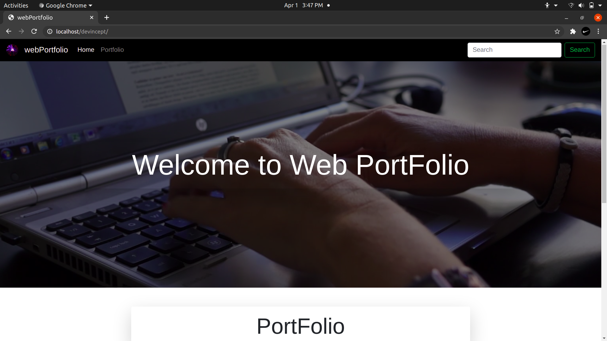

# WebPortfolio :fallen_leaf:

## Mentor :seedling:

> Ritesh Rathod

## Members :palm_tree:

||Name|
|-|-|
|1|Soyabul Islam|
|2|Hrushikesh Das|

 

## About Project :balloon:

Our aim is to create a website containing all the portfolio of participants at one place we decided to work on this projects because as we are web developer so every recruiter expects atleast one portfolio that show case our skills and projects. At the end of this project every participant will have his/her own Portfolio. :leaves:

## Workflow :question:

### Steps :cyclone:

1. Creation of index page where all the Portfolios will be linked :ear_of_rice:
2. Each member will create his own Portfolio :shell:
3. Final step will be to make a pull request on GitHub :electric_plug:

### Task Assigned :pencil:

1. Soyabul Islam :bicyclist:

   - Creation of Portfolio using Angular
   - Linking it to the main file

2. Hrushikesh Das :bicyclist:

   - Creation of Portfolio using React
   - Linking it to the main file

 

Link to Site :- <a href="https://rnrathod16.github.io/DevIncept_Project/">webPortfolio</a>
